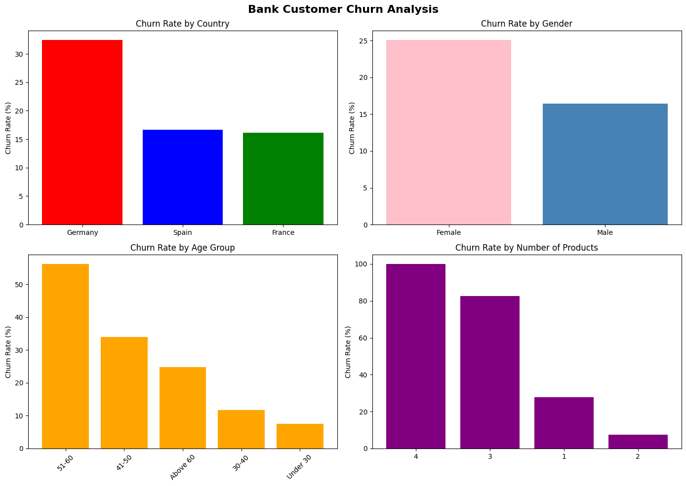

# Bank Customer Churn Analysis - SQL + Python

## Project Overview
Analyzed 10,000 bank customer records using SQL queries and Python to identify which customers are most likely to leave the bank and what patterns can help improve retention.

## Tools Used
- Python
- Pandas
- SQL (pandasql)
- Matplotlib
- Seaborn
- Jupyter Notebook

## Key Insights

1. Overall 20.37% of customers churned — 2,037 out of 10,000
2. Germany has the highest churn rate at 32.44% — about double that of France (16.15%) and Spain (16.67%)
3. Female customers churn more at 25.07% compared to male customers at 16.46%
4. Customers aged 51-60 have the highest churn rate at 56.21%
5. Customers with 3 or more products churn heavily — 82.71% with 3 products and 100% with 4 products (only 60 customers)
6. Customers with 2 products are the most loyal, with only 7.58% churn

## SQL Queries Used
- Customer churn count
- Churn rate by country
- Churn rate by gender
- Churn rate by age group
- Churn rate by number of products

## Dataset
Bank Customer Churn Prediction dataset from Kaggle (10,000 customers)

## View Full Project on Kaggle
https://www.kaggle.com/code/lalitacanada/bank-customer-churn-analysis-sql-python
